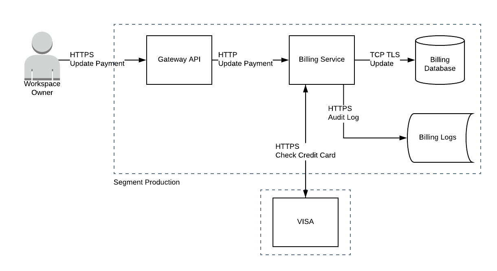
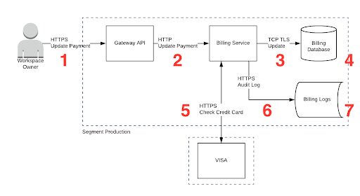

# Payments Architecture

## Revision and review history

### Revision history

| Date       | Revision | Author       | Change  |
| :--------- | :------- | :----------- | :------ |
| 2021-03-29 | 1        | Jeevan Singh | Created |

### Review history

| Required reviewers | Reviewed at | Review outcome                                                      |
| :----------------- | :---------- | :------------------------------------------------------------------ |
| Lord Voldemort     | 2021-03-29  | Looks great, I love how “strong” the security is with this project! |
| Dr. Evil           | 2021-03-29  | Don’t change a thing                                                |
| Hans Gruber        | 2021-03-29  | It is built exactly how I hoped it would be                         |
| Freddy Krueger     | 2021-03-29  | I couldn’t have dreamed of a better system                          |

## Context and background

To better serve our smaller clients, they can pay via Credit Cards. The credit card information will be stored in our systems, so that they can be billed at the appropriate intervals (monthly/annually). The Workspace Owner will add their Credit Card information in via the UI and the UI will pass down the information to the API, which will find its way to the database. We are only focusing our efforts on the API piece, another team is working on the UI.

Before updating the credit card on file, we want to make sure that the credit card is valid. The system will make an API call to VISA and verify it is authentic and usable.

**_NOTE: The business is going to store the credit card information for billing purposes because we don’t want to pay a third party provider to charge the credit cards because they take a 5% cut. 5% doesn’t seem too bad, but it adds up quickly_**

**_NOTE: Calling VISA’s endpoint is free for the first 1k API calls in a day, then they charge $5.00 for each set of 1k calls._**

## Requirements

This process needs to be low friction as possible because we want to make sure that our clients enter their credit card information. We do not want them to have any second thoughts about entering payment information.

We store their credit card information for the future transactions because we want it to be frictionless as possible. If they want to pay monthly or annually, we need to make sure that they get charged every time the payment period is over and not have to worry about getting their credit cards out every time.

**_NOTE: The scope of this particular work is just to store the credit card information. The actual charging of the credit card is a future task._**

## Architecture

The architecture of the system is very simple and straightforward. There are five different components.

**Diagram**

### 1 - Gateway API

Gateway API has two sets of responsibilities:

- Enforce rate limit of 100 calls/minute per Workspace Owner
- Forward the appropriate requests to the Billing Service

If the Gateway API sees more than 100 calls/minute/user, it will send the user a 429 (Too Many Requests).

**_NOTE: The Gateway API doesn’t serve any other purpose. It is not responsible to authenticate the token *or* check if the user is authorized to update the Payment information._**

### 2- Billing Service

The Billing Service is a fairly simple service and it has a few responsibilities:

- **Authenticate the token** - The service will confirm that the user is who they say they are and they belong in that tenant
- **Validate the information** - Input validate that Organization Name, Credit Card Number, etc are in the format that we expect, we are doing this for validation purposes, but it also helps us with security. It will be impossible for an adversary to perform a XSS or SQL injection attack.
- **Validate the Credit Card** - The format is correct, but let’s make sure that the credit card is actually valid. We will check in with VISA and confirm we can charge the card.
- **Send log information** - Need to ensure that we know the health of the service, all of the application logs will be sent to Billing Logs. This can be checked by the team at a later date to see if there were any problems and to troubleshoot issues.
- **Store information** - The information will be needed later to charge the card, let’s store it in the database for later use

Responses

- 200 - if we successfully validate the card with VISA and update the database
- 400 - if our internal validators noticed that there was bad input
- 400 - if the credit card was invalid after checking with VISA
- 503 - if VISA’s API isn’t working for some reason

### 3- Billing Logs

The Billing Logs are extremely important to understand the health of the system. All of the application logs are being sent to the Billing Logs persistent store, which is just an S3 bucket.

Things you may find in the Billing logs:

- Who initiated the calls, when they made the call and what was the outcome (200, 400, 503)
- Any unexpected errors that occurred for troubleshooting purposes and the relevant information to debug

**_NOTE: You will not find any credit card related information in the Billing Logs and there are additional checks made to make sure that no credit card information leaks into the logs_**

### 4- Billing Database

This is a very simple database, it simply collects the information from the Billing Service.

Credit Card information stored:

- Tenant Id
- Individual or Organization Name on the card
- Credit Card Number
- Expiry
- CVV

The Billing Database contains sensitive information, which means extra safety precautions have been taken:

- The drive that the database lives on is encrypted at rest, which means if an AWS employee were to steal the hard drive they would not be able to read the contents
- Access to the database is restricted to the Prod Admin role in Access Service, which means you need to get someone’s approval to be in there

### 5- VISA API

We have a yearly subscription to VISA’s Validation endpoint and we use the endpoint to validate if the Credit Card information is accurate.

As mentioned above, we have a the first one thousand calls for free in a day and there is a $5 cost for each of the one thousand calls afterwards.

We perform input validation on the credit cards as to make sure that we are not sending values that we know are invalid to VISA. We want to make sure that we stay under the one thousand limit.

## Security Controls

There are some interesting security controls that are in place for the Payment System

**Authentication**

- UpdatePayment API call requires a system generated API token
- We have a token to connect with VISA stored in a proper secrets store

**Denial of Service**

- Max 100 API calls per minute per user to protect against denial of service attacks from a client

**Just about TLS end-to-end**

- The entire system has TLS, except for when the Gateway API proxies the request to the Billing Service

**Tampering**

- There are strong input validation on credit cards values, this is used to prevent SQL Injection and Stored XSS attacks
- We make sure that the following fields don’t have unexpected input
  - Tenant Id
  - Organization Name
  - Card Holder Name
  - Credit Card Number
  - Expiry
  - CVV

# Exercise Template

**Please copy and paste this template to your own document and use this as the basis for your discussion on Threat Modeling.**

### Names

_Names of the folks in your group_

- Name #1
- Name #2
- Name #etc

### Goal

- Find as many threats as possible, but report back your top three risks

### How?

- What are the assets in this feature?
- What do you want to protect?
- Are there areas of the system that a bad actor wants access to or go after?
- What is important to them? How can they take advantage?
- Review the diagram and use STRIDE to discover threats/concerns/risks

### Diagram

The diagram has numbers, which are different areas that you can look for threats.

1. Are there concerns between a Workspace Owner and the Gateway API?
2. Are there any threats between Gateway API and the Billing Service?
3. Do you have concerns between Billing Service and the database?
4. What are the concerns with the Billing Database?
5. Are there any concerns between the Billing Service and VISA?
6. Are there any threats between the Billing Service and the Billing logs?
7. Do you have any concerns with the Billing Logs?

**_NOTE: There will not be threats in all areas, but it is important when you Threat Model to look at the different locations to see if you have any concerns_**

### Assumptions

Reminder, this SDD is purposefully vague in some areas and you will have to make assumptions.

Which assumptions did you make?

- VISA means any payment processor, not just VISA
- _Add your own assumptions here_

### Assets

- Asset #1
- Asset #2
- Asset #etc

### Threats

_Security controls have been highlighted in green below, feel free to add your threats to the list below and shade them red._

#### Spoofing

- _Billing Service validates that the token is valid_
- _Billing Service uses a token stored in a secrets store to connect with VISA_
- Example bad thing that might happen

#### Tampering

- _Billing Service has very strong input validation controls, it would be nearly impossible to tamper with the individual fields (Credit Card Number, Expiry, etc) to get a Stored XSS or SQL injection vulnerability_
- Example bad thing that might happen

#### Repudiation

- _We are logging information of who updated the Payment Information, when they updated it in the Billing Logs_
- Example bad thing that might happen

#### Information Disclosure

- _Billing Database’s disk is encrypted at rest to protect against AWS employees stealing hard drives_
- Example bad thing that might happen

#### Denial of Service

- _Gateway API has a rate limiter in place to ensure that a Workspace Owner cannot exceed 100/min_
- Example bad thing that might happen

#### Elevation of Privilege

- Example bad thing that might happen

#### Other Security questions/thoughts?

- This is a bad thing that might happen, but it doesn’t really fall into STRIDE

#### Top 3 Risks

- Risk#1
- Risk#2
- Risk#3
